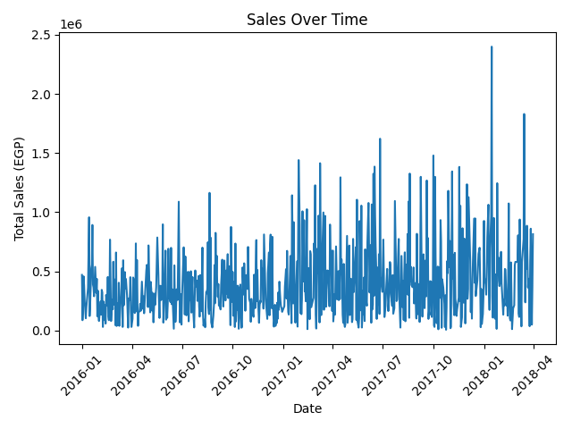
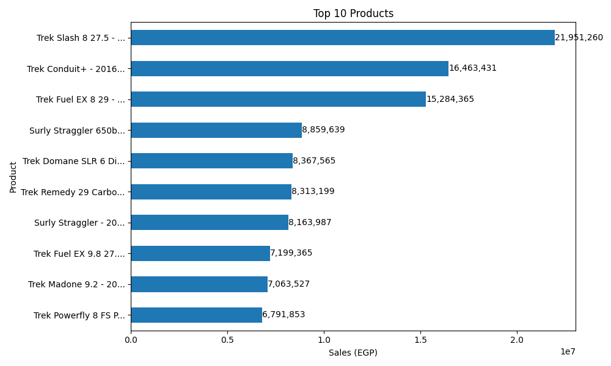
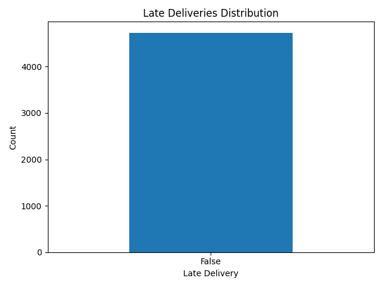

# 🚀 End-to-End ETL Data Engineering Pipeline

## 📌 Overview

This project demonstrates a complete end-to-end ETL pipeline built using Python.
It integrates multiple data sources, applies data cleaning and transformation, builds a data warehouse model, and generates business insights through visualizations.

---

## 🏗️ Architecture

* **Extract**

  * API (Exchange Rates)
  * Database (Orders, Order Items)
  * Data Lake (CSV files)

* **Transform**

  * Data cleaning & validation
  * Currency conversion (USD → EGP)
  * Data enrichment (delivery metrics)
  * Data merging

* **Load**

  * Staging layers
  * Final datasets

* **Modeling**

  * Star Schema:

    * Fact Table: `fact_sales`
    * Dimension Tables:

      * `dim_product`
      * `dim_customer`
      * `dim_store`
      * `dim_date`

---

## 📊 Visualizations

### 📈 Sales Over Time



### 🏆 Top Products



### 🚚 Late Deliveries



---

## ⚙️ Technologies Used

* Python
* Pandas
* Matplotlib
* SQLite
* Git & GitHub

---

## 🚀 How to Run

```bash
python3 main.py
python3 visualization.py
```

---

## 💡 Key Features

* Multi-source data ingestion
* Data quality checks
* Business transformations
* Star schema data modeling
* Data visualization

---

## 👨‍💻 Author

* Ali Emad
* Omar eltawel
